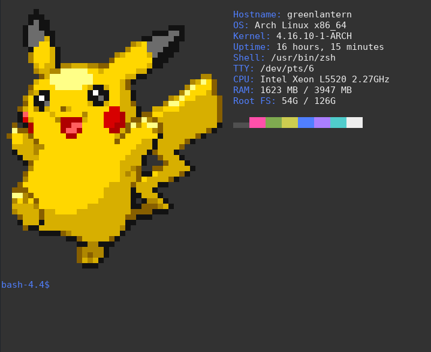

# arTTY

Art for your TTY.



## How to install

Open a terminal and run the following:

```
$ gem install arTTY
```

Or install from source:

```
$ git clone https://gitlab.com/mjwhitta/arTTY.git
$ cd arTTY
$ bundle install && rake install
```

## How to use

I typically add something like the following to the end of my bash/zsh
configs:

```
[[ -z $(command -v arTTY) ]] || arTTY
```

Then I create an arTTY config using something like one of the
following commands:

```
$ arTTY -cf --fit -rs --save
$ arTTY -ce "jynx|nosepass|smoochum" --fit \
    -m "pokemon(-leafgreen)?-I+-" -rs --save
$ arTTY -cf --fit -m "megaman-battle-network" -rs --save
$ arTTY -cfs --save linux-arch
$ arTTY -c --fit -s --save legend-of-zelda-majoras-mask
$ arTTY -c --fit -m "street-fighter-3" -rs --save
```

Use the `--list-supported` or `--ls` flags to see all included images.

### Tab completion

You can add one of the below to your `~/.bashrc` or `~/.zshrc` to get
tab completion.

#### bash

```
if [[ -n $(command -v arTTY) ]]; then
    _arTTY_complete() {
        mapfile -t COMPREPLY < <(arTTY -p --ls -m "^$2")
    }
    complete -F _arTTY_complete art artty arTTY
fi
```

#### zsh

```
if [[ -n $(command -v arTTY) ]]; then
    compdef _gnu_generic art artty arTTY
    _arTTY_complete() {
        reply=($(arTTY -p --ls))
    }
    compctl -K _arTTY_complete art artty arTTY
fi
```

## Generating your own art

ArTTY can generate source code from images too. It will automatically
determine the size, but you can specify a size manually by appending
`_WIDTHxHEIGHT` to the filename. It uses the filename to name the art
unless you manually specify one. It will then `require` any code in
the `$HOME/.config/arTTY/art` directory.

### Examples

```
$ arTTY -g my-art-name.png \
    >$HOME/.config/arTTY/art/my_art_name.rb
$ arTTY -g my-art-name_WIDTHxHEIGHT.png \
    >$HOME/.config/arTTY/art/my_art_name.rb
$ arTTY -g some_image.png my-art-name \
    >$HOME/.config/arTTY/art/my_art_name.rb
```

This will use imagemagick to traverse a `WIDTH` by `HEIGHT` grid and
sample the color inside each cell. It will then generate a ruby class
called `MyArtName`. This works best with sprites, however, it can
parse any image this way.

**Note: Make sure to run `arTTY --cache` after generating new art**

## Links

- [Source](https://gitlab.com/mjwhitta/arTTY)
- [RubyGems](https://rubygems.org/gems/arTTY)
- [Images](https://gitlab.com/mjwhitta/arTTY_images)

## TODO

- Lots more art
    - See [arTTY_images] repo
- RDoc

[arTTY_images]: https://gitlab.com/mjwhitta/arTTY_images#todo
